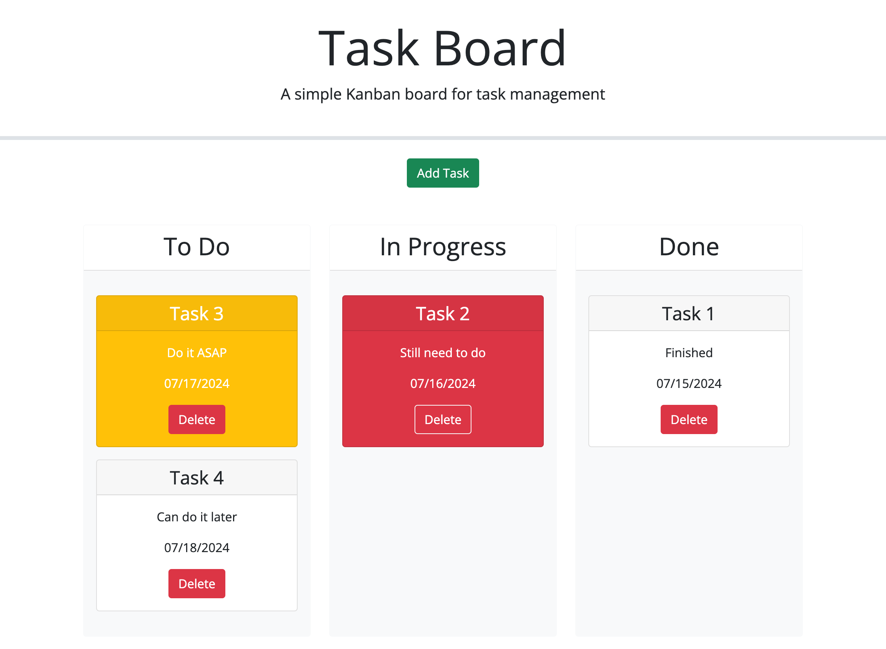

# Task Board (Module 5 Challenge)

## Description
  A webpage of task board.

## Link
  https://zoooe-brooo.github.io/module-5-challenge-task-board/

  

## Credits
  Starter code: https://github.com/coding-boot-camp/musical-happiness

  Code reference: https://git.bootcampcontent.com/University-of-Sydney/USYD-VIRT-FSF-PT-05-2024-U-LOLC/-/tree/main/05-Third-Party-APIs/01-Activities/28-Stu_Mini-Project?ref_type=heads
  